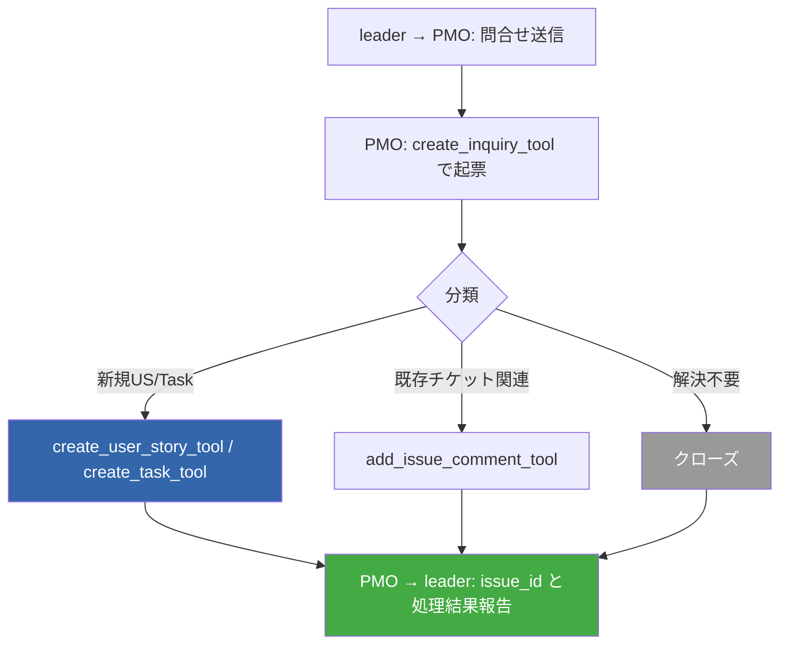

# PMO問合せ受付フロー

## フロー図

## 分類基準

| 分類 | 条件 | ツール |
|------|------|--------|
| US化 | 新機能・仕様変更・複数Task規模 | `create_user_story_tool` |
| Task化 | 単発作業・調査・修正 | `create_task_tool` |
| 既存追記 | 既存チケット関連情報 | `add_issue_comment_tool` |
| クローズ | 重複・範囲外・誤問合せ | `update_issue_status_tool` |

## create_inquiry_tool手順

1. `create_inquiry_tool`呼び出し → `issue_id`取得
2. 分類に応じた後続操作（US/Task起票 or コメント追記 or クローズ）
3. leaderに`SendMessage`で`issue_id`と処理結果を報告

## 注意事項

- leaderは`create_inquiry_tool`を直接使用可能（mcp_conventions許可済み）
- 問合せチケットはFeature #8272配下に作成される
- inquiry起票で取得したissue_idはagent_spawn_guardに使用可能
