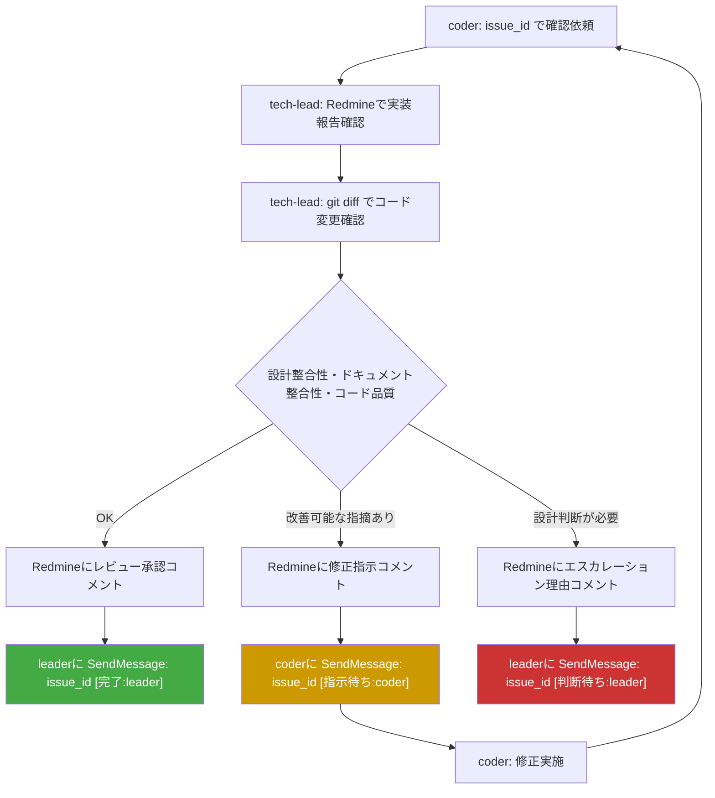
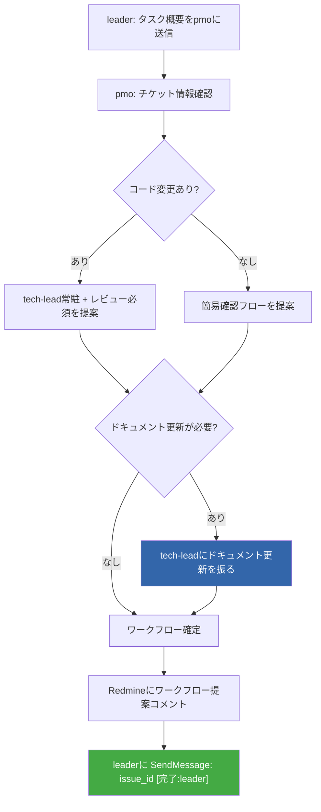
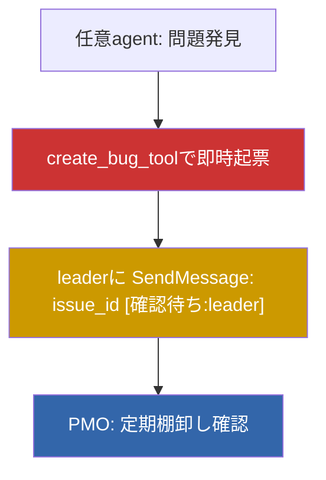

# tasukiワークフロー図

## tech-lead peer-to-peerレビューフロー

### 重要ルール
- 承認 → **leaderに**報告（coderのタスク完了通知）
- 修正指示 → **coderに**直接送信（leader不介在）
- エスカレーション → **leaderに**送信（設計判断はleader/オーナーの責務）

## PMOワークフロー提案フロー

## コミット責務

| role | git commit | git push | 備考 |
|------|-----------|----------|------|
| leader | 許可 | 許可 | エスカレーション時のみ介入。通常フローではtech-leadが完結 |
| tech-lead | 許可 | 許可 | レビュー承認後のコミット・push担当。coderの変更をレビュー→コミット→push |
| coder | **禁止** | **禁止** | 実装のみ。コミットはtech-leadまたはleaderが実行 |

### コミットフロー
1. coder: コード変更を実施（コミットしない）
2. tech-lead: レビュー承認後、変更をコミット・push

## バグ起票エスカレーションフロー (#8194)

全エージェントが問題発見時にcreate_bug_toolで即時起票する。leader/PMOによる握りつぶし防止が目的。

### ルール
- 全エージェント（leader/tech-lead/coder/tester/auditor/pmo）がcreate_bug_toolを使用可能
- 問題発見時は判断を仰がず即時起票する（起票後にleaderへ通知）
- 起票内容: 問題の再現手順・影響範囲・発見経緯を記載

## ステータス別行動マッピング (#8642)

### 受信ステータス別の期待行動

| 受信ステータス | 期待行動 |
|---|---|
| `[指示待ち:自分]` | get_issue_detail_toolで最新コメントから作業指示を取得→作業実行 |
| `[回答待ち:自分]` | get_issue_detail_toolで質問内容を確認→回答をRedmineに記録→送信元に完了報告 |
| `[確認待ち:自分]` | get_issue_detail_toolで確認対象を確認→確認結果をRedmineに記録→送信元に完了報告 |
| `[判断待ち:自分]` | get_issue_detail_toolで判断事項を確認→判断結果をRedmineに記録→送信元に完了報告 |
| `[着手待ち:自分]` | 前提タスク完了通知。get_issue_detail_toolで作業内容を確認→作業開始 |
| `[完了:自分]` | 委譲した作業の完了通知。必要に応じてget_issue_detail_toolで成果を確認 |

### 送信時のステータス選択基準

| 状況 | 送信フォーマット |
|---|---|
| 作業完了 | `issue_id [完了:送信先]` |
| 作業依頼 | `issue_id [指示待ち:送信先]` |
| 質問 | `issue_id [回答待ち:送信先]` |
| 確認依頼 | `issue_id [確認待ち:送信先]` |
| 判断依頼 | `issue_id [判断待ち:送信先]` |
| 前提タスク完了通知 | `issue_id [着手待ち:送信先]` |

### ステータスマッピング（旧→新）

| 旧ステータス | 新ステータス |
|---|---|
| 完了 | `[完了:leader]` |
| 指示 | `[指示待ち:coder]` |
| 要判断 | `[判断待ち:leader]` |
| 通知 | `[確認待ち:leader]` |

## OK/NG例

### OK: 正しいワークフロー
- coder実装完了 → tech-leadにpeer-to-peerレビュー依頼 → 承認後leaderに完了報告
- ドキュメント更新必要 → tech-leadに振る（tech-leadがvibes/docs編集・コミット）
- 設計判断が必要 → tech-leadがleaderにエスカレーション
- coder実装完了 → tech-leadレビュー承認 → tech-leadがgit commit実行
- coderがテスト中にバグ発見 → create_bug_toolで即時起票 → leaderに通知

### NG: 禁止パターン
- **NG**: PMOがcoderにドキュメント修正を指示する（ドキュメント更新はtech-leadの責務）
- **NG**: tech-leadが承認後coderに完了報告する（承認報告先はleader）
- **NG**: coderがleaderを介さずtech-leadにレビュー依頼をスキップする
- **NG**: tech-leadがleaderを介さずPMO/researcherに直接送信する
- **NG**: coderがgit commit/pushを実行する（コミットはtech-lead/leaderの責務）
- **NG**: 問題発見時にleaderに報告のみで起票しない（握りつぶしリスク）
